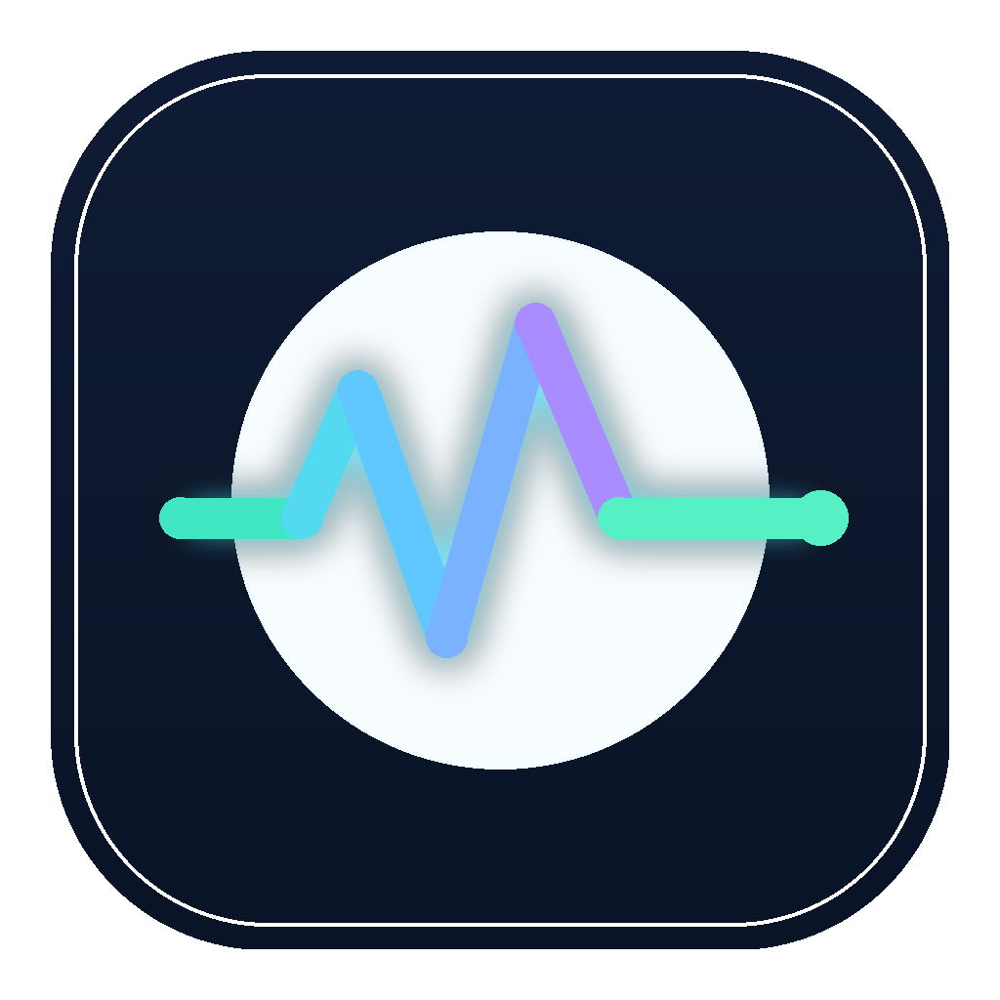
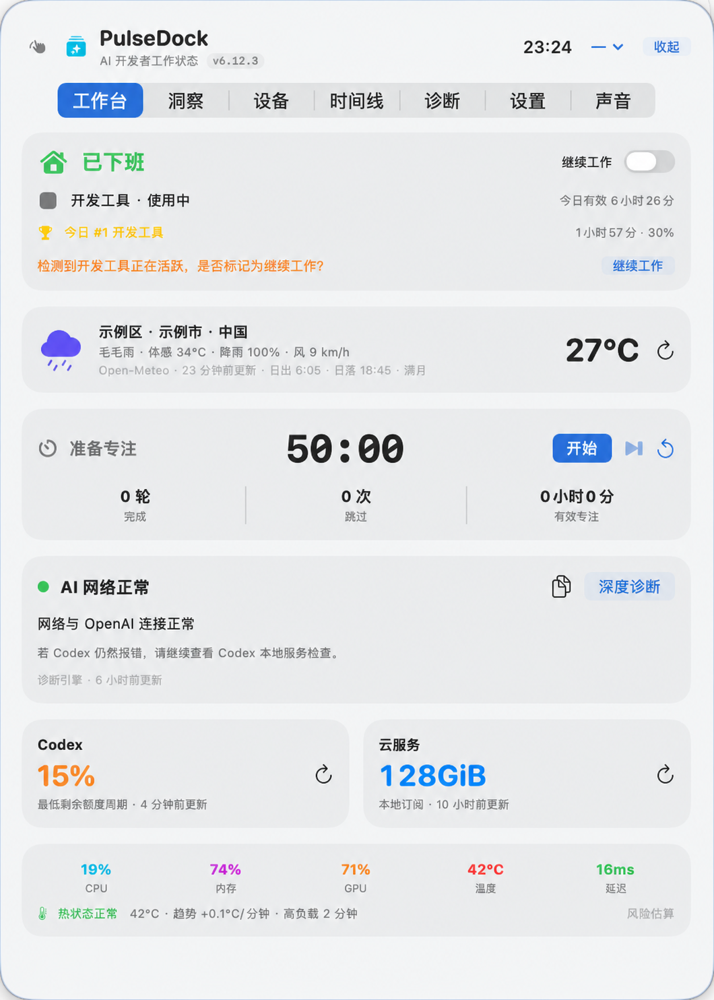

# PulseDock

<p align="center">
  
</p>

<p align="center">
  面向 AI 开发者的 macOS 轻量工作状态浮窗
</p>

<p align="center"><a href="README.md">简体中文</a> | <a href="README.en.md">English</a></p>

<p align="center">
  <a href="https://github.com/asfx0412/PulseDock/releases"></a>
  
  
  
</p>

PulseDock 将 AI 网络健康、Codex 额度、Clash 用量、SSH/GPU 设备、应用活跃度、番茄钟、天气、工作日历和专注声音集中在一个低干扰浮窗中。数据尽量在本机处理，秘密保存在 macOS Keychain，不会写入仓库或导出配置。

> 当前版本：**6.14.0**。安装包面向 Apple Silicon 和 macOS 26。更新器会校验 GitHub Release 清单的 Ed25519 签名、SHA-256、Bundle ID、版本、arm64 与代码签名；仍为 ad-hoc 签名，首次运行可能出现 Gatekeeper 提示。

## 界面预览

<p align="center">
  
</p>

<p align="center"><sub>工作台脱敏示例；位置、应用名称和服务额度为演示数据。</sub></p>

## 主要功能

| 功能域 | 能做什么 | 数据与隐私 |
|---|---|---|
| 工作台 | 上班/下班状态、当前应用、天气、番茄钟、AI 网络、额度和系统指标 | 紧凑浮窗只显示当前最需关注的信息 |
| 洞察 | 今日/7 天/30 天应用排行、Codex Token 活动、节假日和趋势 | 不读取窗口标题、网页、聊天、键盘内容或文件 |
| 设备 | 多 SSH 主机、Load、GPU 显存、温度/功耗、Slurm 任务和 Codex 端点证据 | 复用 `~/.ssh/config` 和 ssh-agent，不保存私钥或密码 |
| 时间线 | 记录网络、设备、额度、热风险、Clash 和番茄钟的发生/恢复 | 本地持久化，不上传遥测 |
| 诊断 | DNS、TLS、代理端口、OpenAI/Codex 端点和界面响应监测 | 可复制报告，但不包含 API Key、密码或未脱敏命令 |
| 设置 | 工作时间、快捷键、主题、天气、Clash、API、SSH、飞书和语言 | 秘密集中保存在 Keychain 统一保险库 |
| 声音 | 24 条 CC0 环境音、工作音乐、网络广播、收藏、定时和播放模式 | 默认不播放，不登录音乐账号，不建立离线音频库 |

## 运行要求

- Apple Silicon Mac（arm64）；
- macOS 26.0 或更高版本；
- 如果从源码构建：Xcode Command Line Tools；
- 如果需要 Codex 额度：本机已安装并登录 Codex CLI；
- 如果需要 SSH/GPU：目标主机已在 `~/.ssh/config` 中配置，且可以通过密钥非交互登录。

Intel Mac 和旧版 macOS 目前未纳入构建与测试范围。

## 安装

### 从 GitHub Releases 安装

1. 打开 [Releases](https://github.com/asfx0412/PulseDock/releases)，下载最新的 `PulseDock-<版本>.zip`。
2. 解压 ZIP，将 `PulseDock.app` 拖入“应用程序”。
3. 首次运行时，在 Finder 中右键 `PulseDock.app` 并选择“打开”。
4. 如果系统仍阻止运行，前往“系统设置 → 隐私与安全性”，确认应用来源后选择“仍要打开”。
5. 如果需要番茄钟、下班或热风险提醒，请允许通知权限。

如果你已确认 ZIP 来自本项目的 GitHub Release，但 Gatekeeper 仍组织运行，可在“终端”执行以移除该 App 的下载隔离标记：

```sh
xattr -dr com.apple.quarantine /Applications/PulseDock.app
open /Applications/PulseDock.app
```

这仅适用于你信任的发布包，不要对来源不明的 App 执行。这是未公证安装包的临时处理方案；正式发布版仍应使用 Developer ID 签名与 Apple 公证。

升级时请先通过浮窗右键菜单或菜单栏完全退出旧版，再替换 `PulseDock.app`。关闭浮窗不等于退出应用。

### 从源码构建

```sh
xcode-select --install
git clone https://github.com/asfx0412/PulseDock.git
cd PulseDock
chmod +x scripts/test.sh scripts/build.sh
./scripts/test.sh
./scripts/build.sh
open outputs/PulseDock.app
```

构建脚本生成 `outputs/PulseDock.app` 和 `outputs/PulseDock-6.14.0.zip`，并执行签名、arm64 与解包验证。GitHub Release 发布还需要配置仅在 GitHub Actions 使用的更新私钥；完整发布仍未具备 Developer ID 签名和 Apple 公证。

## 首次配置

### 浮窗和快捷键

- `⌥ Space`：默认显示/隐藏；
- `⌥ ⇧ Space`：默认展开/收起；
- 可在“设置 → 快捷键”录制其他组合；
- 冲突或注册失败时会保留上一组可用设置。

### Codex 额度

PulseDock 通过本机 Codex `app-server` 的只读接口显示额度窗口和 Token 活动，不读取、导出或刷新 Codex 登录 Token，也不会消耗重置券。

1. 按 [OpenAI 官方 Codex CLI 文档](https://learn.chatgpt.com/docs/codex/cli) 安装 Codex。
2. 在终端运行 `codex`，按官方流程登录。
3. 重新打开 PulseDock，或在 Codex 卡片点击刷新。

### 天气与位置

- 默认使用手动选择的固定地点，不根据公网 IP 或代理节点改变城市；
- 只有主动开启“自动跟随当前位置”时才请求 Core Location 权限；
- 定位失败时保留上次有效天气。

### SSH/GPU 设备

先在终端验证：

```sh
ssh <Host 别名>
```

然后在“设备”页添加同一个 `Host` 别名。PulseDock 使用 `BatchMode=yes`，不会在后台弹出远程密码框。请使用 ssh-agent，并按实际环境选择“仅局域网”、“需要 VPN”或“公网可达”。“脱敏启动命令”需要逐台手动开启。

### Clash/Mihomo

PulseDock 优先读取 Clash Verge/Mihomo 在本机已保存的兼容订阅元数据，不读取或显示订阅 URL。如需刷新 provider：

1. 确认 External Controller 仅监听回环地址，或使用 Clash Verge 的本机 Unix Socket；
2. 在 PulseDock 中点“自动发现”；
3. 如有 Secret，先解锁凭据保险库，再填写并保存；
4. 先验证 `/version`，再同步 provider。

### API 额度与飞书

- GLM、DeepSeek、飞书 Webhook 和 Mihomo Secret 都应在 PulseDock 设置页填写；
- 解锁后，本次运行只主动访问一次统一 Keychain 保险库；
- 输入过程只保留在内存，点“保存全部变更”时才写入 Keychain；
- 配置导出、时间线和可复制诊断不包含秘密。

## 数据和秘密保护

### 本机保存位置

- 非秘密偏好：UserDefaults；
- 活跃度与时间线：`~/Library/Application Support/PulseDock/`；
- API Key、Webhook、签名密钥和 Controller Secret：macOS Keychain 中的 `com.pulsedock.monitor` PulseDock 项。

### 仓库安全规则

- 不要把 `.env`、SSH 私钥、API Key、Webhook、Cookie、订阅 URL、未脱敏诊断或真实服务器截图加入 Git；
- `.gitignore` 已排除常见秘密文件、本地构建目录和发布产物；
- 提交或提 Issue 前，请检查截图中的 SSH 主机、用户名、地址、余额和内网信息；
- 如果秘密曾进入 Git 历史，必须先立即撤销/轮换秘密，再清理历史。

完整边界见 [SECURITY.md](SECURITY.md)。

## 数据源

- Codex 个人额度与 Token 活动：本机 Codex `app-server` 只读接口；
- Codex 社区全局重置信号：Codex Runway 公共 JSON，非 OpenAI 官方承诺；
- 天气、日出日落和月相：Open-Meteo；
- 节假日：项目内根据国务院办公厅公开安排整理的年度数据；
- Clash：本机兼容订阅元数据和可选的本机 Mihomo Controller；
- SSH/GPU：系统 `ssh`、本机 SSH 配置与远端固定只读命令；
- 环境音：已核验作品页与 CC0 许可的 Freesound 录音；
- 工作音乐和广播目录：Radio Browser 公开目录。

完整来源、刷新节奏、认证材料与降级策略见 [DATA_SOURCE_CATALOG.md](DATA_SOURCE_CATALOG.md)。

## 测试

```sh
./scripts/test.sh
```

测试覆盖额度解析、网络范围、SSH/GPU 畸形输入、脱敏规则、统一凭据保险库、音频 URL 安全、中文输入和快捷键回归。真实 SSH 冒烟测试必须显式传入已授权别名：

```sh
./scripts/test-remote.sh <Host 别名>
```

详细门禁见 [TESTING.md](TESTING.md) 和 [RELEASE_CHECKLIST.md](RELEASE_CHECKLIST.md)。

## 卸载

1. 如需同时清除凭据，先在 PulseDock 中选择“清除统一凭据保险库”；
2. 完全退出 PulseDock；
3. 删除 `PulseDock.app`；
4. 如需删除本地历史，备份后再删除 `~/Library/Application Support/PulseDock/` 与 PulseDock 相关 UserDefaults。

## 项目文档

- [完整使用文档](outputs/PulseDock使用文档.md)
- [更新日志](CHANGELOG.md)
- [安全与隐私](SECURITY.md)
- [数据源目录](DATA_SOURCE_CATALOG.md)
- [环境音来源与许可](AMBIENT_SOUND_CATALOG.md)
- [产品规范](PRODUCT_SPEC.md)
- [架构说明](ARCHITECTURE.md)
- [测试说明](TESTING.md)
- [贡献指南](CONTRIBUTING.md)

## 当前限制

- 只构建和测试 Apple Silicon + macOS 26；
- 安装包尚未公证，首次打开需要用户明确确认；
- 自动更新只会在 GitHub Actions 的签名清单、私钥 Secret、发布构建与旧版到新版真实升级测试都完成后启用；若其中任一验证失败，应用会拒绝安装。
- Cursor 个人额度依赖本机非公开内部接口，上游字段变化时会明确降级；
- Radio Browser 是第三方目录，不保证所有音源在每个地区都可用。

## 许可证

项目尚未选定开源许可证。在添加 `LICENSE` 之前，默认保留所有权利，请勿未经授权复制、修改或再分发。
