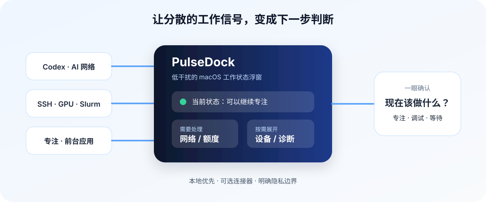

# PulseDock

<p align="center"></p>

<p align="center"><strong>给 AI 开发者的 macOS 工作状态驾驶舱</strong></p>

<p align="center">在一个低干扰浮窗里，看清现在是否适合专注、调试或继续跑任务。</p>

<p align="center"><a href="README.md">简体中文</a> | <a href="README.en.md">English</a></p>

<p align="center">
  <a href="https://github.com/asfx0412/PulseDock/releases/latest"></a>
  
  
  
</p>

<p align="center"><a href="https://github.com/asfx0412/PulseDock/releases/latest">下载最新版本</a> · <a href="#三分钟开始">三分钟开始</a> · <a href="#核心优势">了解核心优势</a></p>

PulseDock 面向同时关心 AI 服务、远程设备和专注节奏的 macOS 开发者。它把当前前台应用、专注计时、网络与额度状态、天气和可选设备信号放进一个可收起的浮窗；默认只显示此刻值得处理的信息。数据尽量在本机处理，秘密保存在 macOS Keychain，不会写入仓库或导出配置。

> **适合谁：** 使用 Apple Silicon Mac、在本机使用 Codex，并可能需要查看网络、远程 SSH/GPU 或专注状态的开发者。它不是通用的团队监控平台，也不会读取网页、聊天、窗口标题、输入内容或文件。

## 核心优势

| 优势 | 解决的问题 | PulseDock 如何做到 |
|---|---|---|
| **一眼掌握，而非多开十个页面** | 编码、跑任务、远程调试时，很难判断当前该处理什么 | 工作台把前台应用、工作状态、番茄钟、AI 网络、额度和系统提示聚合成低干扰浮窗；需要时再展开细节 |
| **为 AI 开发工作流而生** | 配额、网络可达性和远程 GPU 往往分散在终端、网页和多个工具中 | 读取本机 Codex 只读状态，可选接入 Clash/Mihomo、SSH/GPU、Slurm 与 API 额度；每项能力按需开启 |
| **本地优先，边界说清楚** | 监控工具最容易让人担心隐私与凭据安全 | 活跃度只到应用层；敏感值进 Keychain；时间线在本机；诊断和导出会排除 API Key、密码和未脱敏命令 |

## 你可以用它做什么

### 现在：一个不打断工作的状态面板

- 看当前前台应用、工作/下班状态、天气、番茄钟、AI 网络、额度和系统指标；
- 用 `⌥ Space` 显示或隐藏浮窗，用 `⌥ ⇧ Space` 在紧凑与完整视图间切换；
- 当数据暂时不可用时保留最后成功结果并显示刷新状态，而不是把一次波动直接当成故障。

### 需要时：展开为开发环境概览

- **洞察：** 今日、7 天、30 天的应用活跃度与 Codex Token 活动；
- **设备：** 可选的 SSH 主机、负载、GPU 显存、温度/功耗和 Slurm 任务；
- **诊断：** DNS、TLS、代理端口、OpenAI/Codex 端点和界面响应的可复制证据；
- **时间线：** 网络、设备、额度、热风险、Clash 与番茄钟的发生和恢复记录；
- **声音：** CC0 环境音、工作音乐和网络广播，默认静音、按需播放。

## 工作方式

<p align="center"></p>

<p align="center"><sub>产品价值图，不是界面截图。当前稳定版本的功能、安装包和变更请以 <a href="https://github.com/asfx0412/PulseDock/releases/latest">最新 Release</a> 与更新日志为准。</sub></p>

## 三分钟开始

### 1. 安装

1. 打开 [最新 Release](https://github.com/asfx0412/PulseDock/releases/latest)，下载 `PulseDock-<版本>.zip`。
2. 解压后，将 `PulseDock.app` 拖入“应用程序”文件夹。
3. 首次运行时，在 Finder 中按住 Control 点按 `PulseDock.app`，选择“打开”。
4. 若 macOS 仍阻止运行，请在“系统设置 → 隐私与安全性”确认来源后点“仍要打开”。
5. 需要番茄钟、下班或热风险提醒时，再允许通知权限。

安装包当前为 ad-hoc 签名，尚未完成 Apple 公证。确认 ZIP 来自本项目的 GitHub Release 后，如 Gatekeeper 仍阻止运行，可在“终端”执行：

```sh
xattr -dr com.apple.quarantine /Applications/PulseDock.app
open /Applications/PulseDock.app
```

这只适用于你信任的发布包；不要对来源不明的 App 执行。升级时请先通过浮窗右键菜单或菜单栏完全退出旧版，再替换 `PulseDock.app`。关闭浮窗不等于退出应用。

### 2. 先使用默认能力

无需填写密钥即可使用浮窗、前台应用记录、番茄钟、手动天气与本机基础指标。Codex、远程设备、Clash/Mihomo、API 额度和飞书均为可选连接器：只在你主动配置后才会读取或访问相应服务。

### 3. 按需接入开发环境

- **Codex 额度：** 本机安装并登录 Codex CLI 后，PulseDock 通过本机 `app-server` 的只读接口显示额度窗口与 Token 活动，不读取、导出或刷新登录 Token，也不消耗重置券。
- **天气与位置：** 默认使用手动地点，不根据公网 IP 或代理节点改变城市；只有你主动开启“自动跟随当前位置”才会请求定位权限。定位失败时保留上次有效天气。
- **SSH/GPU：** 先在终端确认 `ssh <Host 别名>` 可通过密钥非交互登录，再在“设备”页添加同一别名。PulseDock 使用 `BatchMode=yes`，不会在后台弹出密码框。
- **Clash/Mihomo：** 仅连接本机兼容元数据或回环 Controller/本机 Unix Socket；订阅 URL 不会显示或导出。
- **API 额度与飞书：** 仅在设置页填写，保存后写入 Keychain；配置导出、时间线和可复制诊断不包含秘密。

## 功能边界与隐私

| 能力 | 明确边界 |
|---|---|
| 应用活跃度 | 只记录 macOS 前台应用层级；不读取窗口标题、网页、ChatGPT/Codex 页面、聊天内容、键盘输入或文件 |
| 凭据 | API Key、Webhook、Controller Secret 等存于 macOS Keychain；编辑时留在内存，保存时才写入 |
| 数据 | 非秘密偏好放在 UserDefaults；活跃度和时间线保存在 `~/Library/Application Support/PulseDock/`；不上传遥测 |
| 诊断与截图 | 复制报告会排除秘密和未脱敏命令；提交 Issue 或分享截图前仍须自行检查主机、用户名、地址、余额、地点和内网信息 |

完整安全边界见 [SECURITY.md](SECURITY.md)，外部数据源、刷新频率与降级策略见 [DATA_SOURCE_CATALOG.md](DATA_SOURCE_CATALOG.md)。

## 运行要求

- Apple Silicon Mac（arm64）；
- macOS 26.0 或更高版本；
- 如从源码构建：Xcode Command Line Tools；
- 如需 Codex 额度：本机已安装并登录 Codex CLI；
- 如需 SSH/GPU：目标主机已配置在 `~/.ssh/config` 中，且支持密钥非交互登录。

Intel Mac 和旧版 macOS 当前未纳入构建与测试范围。

## 从源码构建

```sh
xcode-select --install
git clone https://github.com/asfx0412/PulseDock.git
cd PulseDock
chmod +x scripts/test.sh scripts/build.sh
./scripts/test.sh
./scripts/build.sh
open outputs/PulseDock.app
```

构建会生成 `outputs/PulseDock.app` 和与 [`VERSION`](VERSION) 一致的 ZIP，并执行签名、arm64 与解包验证。GitHub Release 的更新清单在 Actions 中签名并反验；完整的生产分发仍需要 Developer ID 签名和 Apple 公证。

## 文档与维护

- [完整使用文档](outputs/PulseDock使用文档.md)
- [更新日志](CHANGELOG.md)
- [产品定位与对外表达](docs/PRODUCT_MESSAGING.md)
- [社媒宣传文案包](docs/PROMOTION_COPY.md)
- [安全与隐私](SECURITY.md)
- [数据源目录](DATA_SOURCE_CATALOG.md)
- [测试说明](TESTING.md) 与 [发布检查清单](RELEASE_CHECKLIST.md)
- [文档维护规范](docs/DOCUMENTATION_POLICY.md)
- [贡献指南](CONTRIBUTING.md)

## 测试与已知限制

运行离线回归：

```sh
./scripts/test.sh
```

测试覆盖额度解析、网络范围、SSH/GPU 畸形输入、脱敏规则、统一凭据保险库、音频 URL 安全、中文输入、快捷键和文档一致性。真实 SSH 冒烟测试必须显式传入已授权别名：

```sh
./scripts/test-remote.sh <Host 别名>
```

- 仅 Apple Silicon + macOS 26 被构建和测试；
- 安装包尚未公证，首次打开需要用户明确确认；
- 自动更新只有在签名清单、发布构建及跨版本升级验证全部通过时才会安装；任何验证失败都会拒绝更新；
- Cursor 个人额度依赖本机非公开内部接口，上游字段变化时会明确降级；
- Radio Browser 是第三方目录，不保证每个地区都能使用所有音源。

## 卸载

1. 若同时清除凭据，先在 PulseDock 中选择“清除统一凭据保险库”；
2. 完全退出 PulseDock；
3. 删除 `PulseDock.app`；
4. 如需删除本地历史，备份后删除 `~/Library/Application Support/PulseDock/` 与 PulseDock 相关 UserDefaults。

## 许可证

项目尚未选定开源许可证。在添加 `LICENSE` 之前，默认保留所有权利，请勿未经授权复制、修改或再分发。
